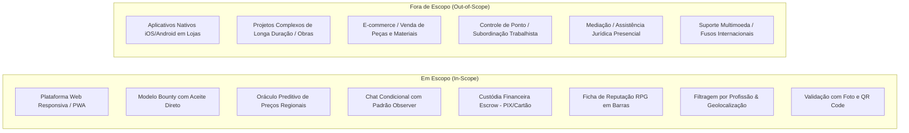

# Resumo Executivo - Projeto Bico Digital

> **Documentação de Especificação e Alinhamento Estratégico**  
> **Origem**: Análise e extração automatizada do arquivo `FABRICA 1.0 (1).pdf`  
> **Instituição**: Centro Universitário FACOL (UNIFACOL) - Bacharelado em Sistemas de Informação  
> **Data**: Agosto de 2026 | **Versão**: 1.0

---

## 1. Identificação do Projeto e Equipe

- **Nome da Plataforma**: **BICO DIGITAL**
- **Patrocinador**: NazaTech
- **Docente Orientador**: Prof. Alisson Ferreira
- **Matriz de Responsabilidades da Equipe (RACI)**:

| Nome do Integrante | Papel Principal | Cargo / Atribuições |
| :--- | :--- | :--- |
| **Wanderllan Santos da Paixão** | Product Owner (PO) / Agilist | Definição de escopo, priorização de entregas, visão de produto, UI/UX Designer |
| **Diego Felipe da Silva Avelino** | Software Engineer | Arquitetura de software, desenvolvimento full-stack, manutenção e supervisão |
| **João Victor da Silva Santos** | Quality Assurance (QA) / PO Auxiliar | Definição de estórias de usuário, teste de módulos, critérios de aceite e qualidade |
| **Klismans do Nascimento Nazário** | Technical Writer (TW) | Documentação técnica, comercial, manuais e consolidação de requisitos |

---

## 2. Visão Geral e Proposta de Valor

### 2.1 Problema Identificado no Mercado
O mercado atual de prestação de serviços autônomos por demanda no Brasil sofre com grave ineficiência operacional:
1. **Lentidão e Espera Passiva**: Clientes dependem de orçamentos lentos de escopo aberto, esperando horas ou dias sem referência clara de preço justo.
2. **Ruído e Spam em Comunicação**: Chats abertos resultam em sobrecarga de mensagens irrelevantes e negociações frustradas.
3. **Reputação Imprecisa**: Sistemas tradicionais baseados em médias genéricas de estrelas falham em refletir as reais habilidades comportamentais e técnicas dos prestadores.

### 2.2 A Solução: Bico Digital
O **Bico Digital** subverte a lógica tradicional introduzindo o modelo de **Recompensa Pré-Fixada (Bounty)**:
- O cliente publica a tarefa com o valor pré-estabelecido em dinheiro.
- O prestador qualificado visualiza a oferta em sua região e aceita com **1 único clique**, realizando a contratação imediata sem leilão de preços.
- **Oráculo de Preços**: Inteligência de dados que analisa histórico regional para recomendar faixas de preço equilibradas.
- **Custódia Financeira (Escrow)**: Garantia de pagamento mantida retida pela plataforma e liberada assincronamente após a confirmação do serviço com registro fotográfico.
- **Ficha de Reputação RPG**: Avaliação mútua qualitativa em gráfico de barras (5 atributos para o profissional e 4 para o cliente), desbloqueando medalhas de especialidade.

---

## 3. Escopo e Fronteiras do Sistema

---

## 4. Premissas e Restrições Estratégicas

### 4.1 Premissas
1. Clientes e prestadores possuem conexão estável à internet e utilizam navegadores web modernos (desktop ou mobile).
2. Provedores de API externa de geolocalização (Google Maps) e gateways de pagamento operam de forma contínua.
3. Usuários apresentam documentos autênticos (CPF/CNPJ) para validação de identidade e conformidade com a LGPD.

### 4.2 Restrições
1. **Exclusividade Web**: O sistema será exclusivamente um Progressive Web App (PWA), sem aplicativos nativos instaláveis.
2. **Moeda e Território**: Restrito ao território brasileiro, idioma Português e moeda Real (BRL).
3. **Conformidade LGPD**: Encriptação e rigoroso controle no tratamento de dados pessoais.

---

## 5. Cronograma e Orçamento Consolidado

- **Data de Início do Projeto**: 03/02/2026
- **Data Prevista de Lançamento do MVP**: 24/11/2026
- **Orçamento Total Estimado**: **R$ 118.168,00**

### Detalhamento Orçamentário:
- **Desenvolvimento (4 devs x 120h x R$ 60/h)**: R$ 64.800,00
- **Equipamentos (4 Notebooks Lenovo LOQ Core i5 / RTX 3050)**: R$ 20.248,00
- **Consumo Geral / Transporte / Alimentação (9 meses)**: R$ 28.800,00
- **Internet da Equipe (9 meses)**: R$ 4.320,00
- **Hospedagem & Infraestrutura Anual (SmarterAsp + Cloudflare)**: R$ 3.000,00
