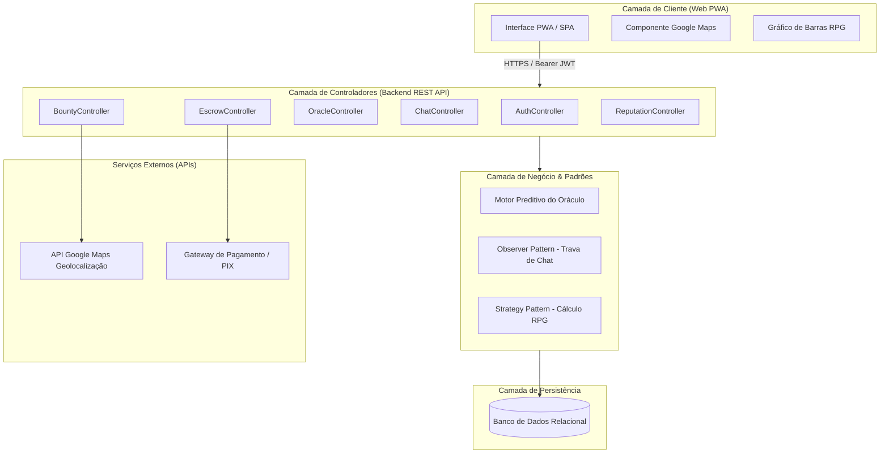

# Especificação de Arquitetura de Software e APIs REST - Bico Digital

> **Documento de Arquitetura de Software (MVC / PWA / REST)**  
> **Sistema**: BICO DIGITAL  
> **Autores**: Diego Felipe da Silva Avelino (Software Engineer) & Equipe de Engenharia

---

## 1. Visão Geral da Arquitetura

O **Bico Digital** adota uma arquitetura em camadas **Cliente-Servidor (MVC)**. O frontend opera como uma aplicação web responsiva em modelo **PWA (Progressive Web App)** desenvolvida em Javascript/HTML5, enquanto o backend disponibiliza endpoints RESTful seguros alimentados por um banco de dados relacional.



---

## 2. Design Patterns Aplicados

1. **Model-View-Controller (MVC)**: Isola a interface de usuário (View) dos algoritmos de precificação e regras de negócio (Model) através dos controladores (Controller).
2. **Singleton**: Utilizado para gerenciar e manter uma única instância global de conexão com o banco de dados relacional e serviços de pagamentos.
3. **Observer**: Utilizado no recurso de **Bloqueio Condicional do Chat**. O componente de comunicação escuta o estado da demanda (`demanda.status`); ao mudar para `EM_ANDAMENTO`, o chat é notificado e desbloqueado automaticamente.
4. **Strategy**: Empregado no cálculo da **Ficha de Reputação RPG**, permitindo alterar os pesos e critérios de cálculo para cada tipo de avaliação (Prestador vs Cliente).

---

## 3. Especificação Completa das APIs RESTful

### 3.1 Autenticação e Gestão de Usuários

#### `POST /api/v1/auth/register`
- **Descrição**: Realiza o cadastro inicial de um cliente ou prestador de serviços.
- **Request Body**:
```json
{
  "nome": "Diego Felipe",
  "email": "diego@exemplo.com",
  "senha": "senhaSegura123!",
  "cpf_cnpj": "123.456.789-00",
  "tipo_usuario": "PRESTADOR",
  "categoria_profissional": "ELETRICA"
}
```
- **Response (201 Created)**:
```json
{
  "success": true,
  "message": "Usuário cadastrado com sucesso",
  "user_id": "8f3b2c1d-4e5f-6a7b-8c9d-0e1f2a3b4c5d"
}
```

---

### 3.2 Publicação de Demandas (Bounty) e Oráculo de Preços

#### `POST /api/v1/oracle/estimate`
- **Descrição**: Consulta a faixa de valor justo calculada pelo algoritmo preditivo do Oráculo.
- **Request Body**:
```json
{
  "categoria": "ELETRICA",
  "latitude": -8.1189,
  "longitude": -35.2891,
  "raio_km": 15
}
```
- **Response (200 OK)**:
```json
{
  "categoria": "ELETRICA",
  "valor_minimo_sugerido": 80.00,
  "valor_medio_sugerido": 120.00,
  "valor_maximo_sugerido": 160.00,
  "base_amostral": 42
}
```

#### `POST /api/v1/bounties`
- **Descrição**: Publica uma nova demanda retendo o valor em custódia.
- **Headers**: `Authorization: Bearer <jwt_token>`
- **Request Body**:
```json
{
  "titulo": "Conserto de disjuntor principal",
  "descricao": "Troca de disjuntor de 50A no quadro de distribuição.",
  "categoria": "ELETRICA",
  "valor_recompensa": 120.00,
  "latitude": -8.1189,
  "longitude": -35.2891,
  "endereco": "Rua Principal, 100 - Vitória de Santo Antão"
}
```
- **Response (201 Created)**:
```json
{
  "demanda_id": "b1a2c3d4-e5f6-7a8b-9c0d-1e2f3a4b5c6d",
  "status": "CRIADA",
  "status_custodia": "RETIDO"
}
```

---

### 3.3 Aceite Imediato e Chat Condicional

#### `POST /api/v1/bounties/{id}/accept`
- **Descrição**: Aceite em 1 clique realizado pelo prestador.
- **Response (200 OK)**:
```json
{
  "demanda_id": "b1a2c3d4-e5f6-7a8b-9c0d-1e2f3a4b5c6d",
  "status": "EM_ANDAMENTO",
  "chat_bloqueado": false,
  "prestador_id": "8f3b2c1d-4e5f-6a7b-8c9d-0e1f2a3b4c5d"
}
```

---

### 3.4 Conclusão de Serviço e Reputação RPG

#### `POST /api/v1/bounties/{id}/complete`
- **Descrição**: Envio de foto comprovatória e solicitação de encerramento.
- **Request Body**:
```json
{
  "url_foto_validacao": "https://storage.bicodigital.com/evidencias/foto_123.jpg"
}
```
- **Response (200 OK)**:
```json
{
  "demanda_id": "b1a2c3d4-e5f6-7a8b-9c0d-1e2f3a4b5c6d",
  "status": "CONCLUIDA",
  "status_custodia": "LIBERADO_PARA_PRESTADOR"
}
```
