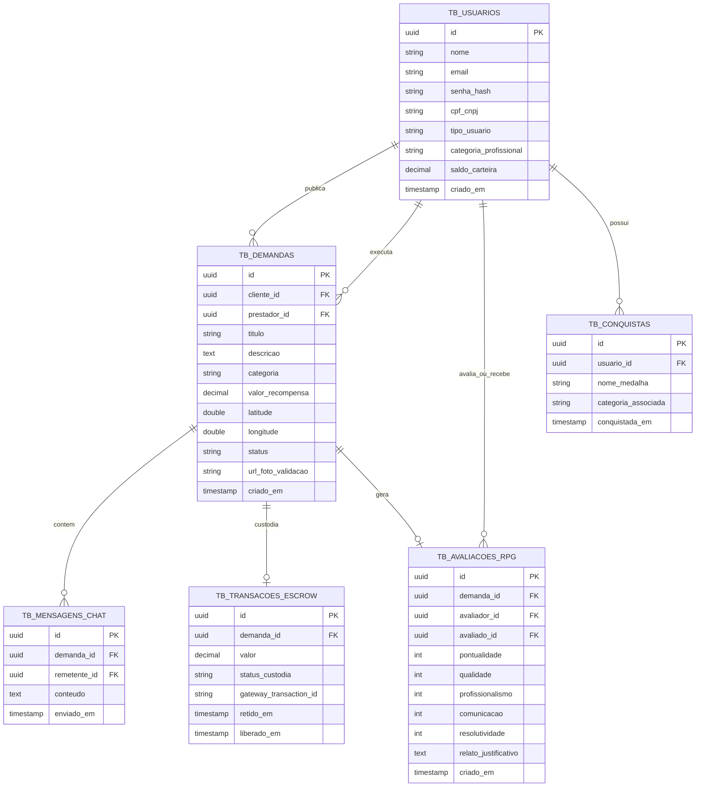

# Especificação de Banco de Dados Relacional - Bico Digital

> **Documento de Modelagem de Banco de Dados (Relacional / ERD)**  
> **Sistema**: BICO DIGITAL  
> **Autores**: Equipe de Engenharia de Banco de Dados

---

## 1. Diagrama de Entidade e Relacionamento (ERD)

---

## 2. Dicionário de Dados

### 2.1 Tabela `tb_usuarios`
- `id` (`UUID`, Primary Key): Identificador único do usuário.
- `nome` (`VARCHAR(150)`, NOT NULL): Nome completo do usuário.
- `email` (`VARCHAR(150)`, UNIQUE, NOT NULL): E-mail de login.
- `senha_hash` (`VARCHAR(255)`, NOT NULL): Hash da senha (`bcrypt`).
- `cpf_cnpj` (`VARCHAR(18)`, UNIQUE, NOT NULL): CPF ou CNPJ validado por algoritmo.
- `tipo_usuario` (`VARCHAR(20)`, NOT NULL): Enum (`'CLIENTE'`, `'PRESTADOR'`).
- `categoria_profissional` (`VARCHAR(50)`, NULLABLE): Categoria ativa de trabalho (ex: `'ELETRICA'`, `'TI'`).
- `saldo_carteira` (`DECIMAL(10,2)`, DEFAULT 0.00): Saldo digital em BRL.

### 2.2 Tabela `tb_demandas`
- `id` (`UUID`, Primary Key): Identificador único da oferta Bounty.
- `cliente_id` (`UUID`, Foreign Key -> `tb_usuarios.id`): ID do cliente contratante.
- `prestador_id` (`UUID`, Foreign Key -> `tb_usuarios.id`, NULLABLE): ID do prestador que aceitou a oferta.
- `titulo` (`VARCHAR(150)`, NOT NULL): Título resumido da tarefa.
- `descricao` (`TEXT`, NOT NULL): Detalhamento do serviço.
- `categoria` (`VARCHAR(50)`, NOT NULL): Categoria profissional da tarefa.
- `valor_recompensa` (`DECIMAL(10,2)`, NOT NULL): Valor pré-fixado pelo cliente em BRL.
- `latitude` (`DOUBLE PRECISION`, NOT NULL): Coordenada de latitude para o mapa.
- `longitude` (`DOUBLE PRECISION`, NOT NULL): Coordenada de longitude para o mapa.
- `status` (`VARCHAR(30)`, NOT NULL): Enum (`'CRIADA'`, `'EM_ANDAMENTO'`, `'CONCLUIDA'`, `'CANCELADA'`).
- `url_foto_validacao` (`VARCHAR(255)`, NULLABLE): URL da foto de comprovação do serviço.

### 2.3 Tabela `tb_transacoes_escrow`
- `id` (`UUID`, Primary Key): Identificador da custódia.
- `demanda_id` (`UUID`, Foreign Key -> `tb_demandas.id`): ID da demanda vinculada.
- `valor` (`DECIMAL(10,2)`, NOT NULL): Montante retido.
- `status_custodia` (`VARCHAR(30)`, NOT NULL): Enum (`'RETIDO'`, `'LIBERADO_PARA_PRESTADOR'`, `'ESTORNADO'`).

### 2.4 Tabela `tb_avaliacoes_rpg`
- Armazena as notas individuais (0 a 10) nos 5 atributos de reputação do profissional e nos 4 atributos do cliente, utilizadas para gerar o gráfico em barras espelhado no perfil público.
